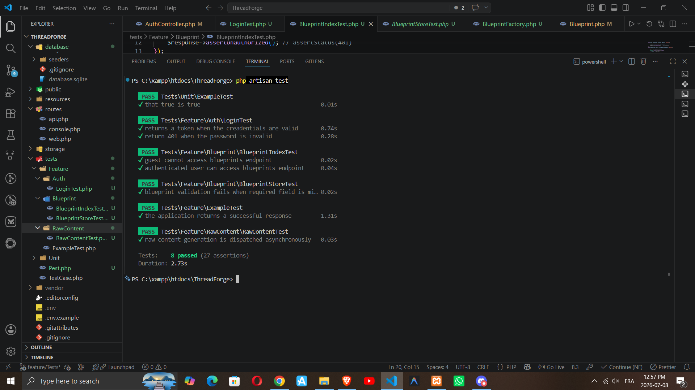
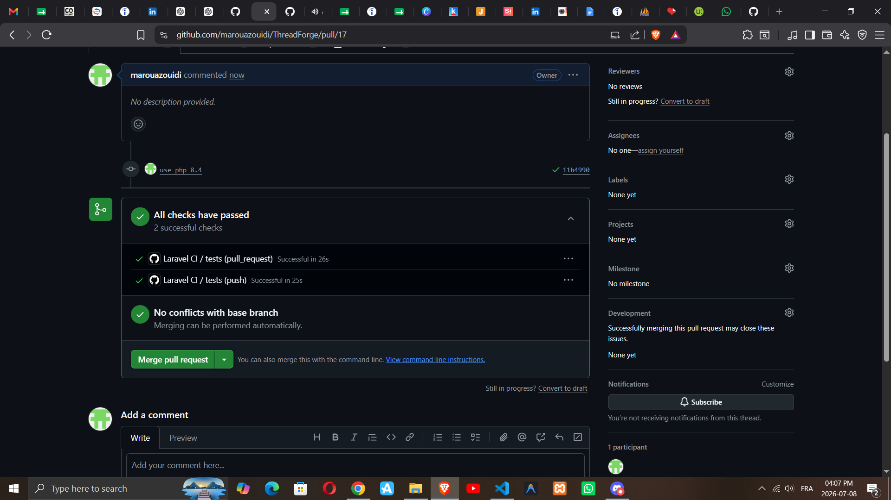

# 🚀 ThreadForge API

> AI-powered REST API built with Laravel that generates social media content asynchronously using Laravel AI, Groq, Queues, and GitHub Actions CI.

---

# 📸 Project Preview

## 🧪 Feature Tests

All feature tests pass successfully.

📸 **INSERT SCREENSHOT HERE**
> Screenshot of `php artisan test`

---

## 🔄 Continuous Integration

GitHub Actions automatically runs all tests on every Push and Pull Request.

📸 **INSERT SCREENSHOT HERE**
> Screenshot showing ✅ All checks have passed

---

## ☁️ Azure Virtual Machine

ThreadForge is deployed on an Ubuntu Virtual Machine hosted on Microsoft Azure.

📸 **INSERT SCREENSHOT HERE**
> Screenshot of Azure VM Overview

---

# 📖 Table of Contents

- Overview
- Features
- Technologies
- Architecture
- Project Structure
- Installation
- Environment Variables
- Running the Project
- Queue Worker
- Authentication
- API Endpoints
- Testing
- Continuous Integration
- Azure Deployment
- Future Improvements

---

# 📌 Overview

ThreadForge is an AI-powered backend API designed to generate high-quality social media content from reusable writing blueprints.

Instead of making users wait while AI generates content, the application dispatches the request to a background Job using Laravel Queues. This keeps the API fast and responsive.

The project demonstrates modern backend development practices including asynchronous processing, automated testing, continuous integration, and cloud deployment.

---

# ✨ Features

- User Authentication (Laravel Sanctum)
- Blueprint CRUD
- AI Content Generation
- Asynchronous Jobs
- Queue Processing
- Laravel AI SDK
- Groq Integration
- Feature Testing with Pest
- GitHub Actions CI
- Azure VM Deployment

---

# 🛠 Technologies

| Technology | Purpose |
|------------|---------|
| Laravel 13 | Backend Framework |
| PHP 8.4 | Programming Language |
| Laravel AI | AI SDK |
| Groq | LLM Provider |
| Sanctum | Authentication |
| SQLite / MySQL | Database |
| Pest | Testing |
| GitHub Actions | CI/CD |
| Azure VM | Cloud Hosting |
| Ubuntu Server | Production Server |
| Nginx | Web Server |

---

# 🏗 Architecture

```text
                    Client
                       │
                       ▼
                 Laravel API
                       │
       ┌───────────────┴───────────────┐
       │                               │
 Authentication                 Blueprint CRUD
       │
       ▼
Generate Raw Content
       │
       ▼
Dispatch Job
       │
       ▼
Laravel Queue
       │
       ▼
Laravel AI SDK
       │
       ▼
Groq API
       │
       ▼
Generated Content
       │
       ▼
Database
```

📸 **INSERT ARCHITECTURE DIAGRAM HERE**

---

# 📂 Project Structure

```text
app
│
├── Http
│   ├── Controllers
│   ├── Requests
│   └── Resources
│
├── Jobs
├── Models
├── Services
│
database
│
├── migrations
├── factories
└── seeders
│
routes
│
├── api.php
└── web.php
│
tests
├── Feature
└── Unit
```

---

# ⚙ Installation

Clone the repository

```bash
git clone https://github.com/your-username/threadforge.git

cd threadforge
```

Install dependencies

```bash
composer install
```

Create environment file

```bash
cp .env.example .env
```

Generate application key

```bash
php artisan key:generate
```

Run migrations

```bash
php artisan migrate
```

Start the application

```bash
php artisan serve
```

---

# 🔑 Environment Variables

```env
APP_NAME=ThreadForge

DB_CONNECTION=mysql

QUEUE_CONNECTION=database

AI_DRIVER=groq

GROQ_API_KEY=YOUR_API_KEY
```

---

# ⚙ Queue Worker

Since AI generation runs asynchronously, start the queue worker.

```bash
php artisan queue:work
```

---

# 🔐 Authentication

Authentication is handled using Laravel Sanctum.

Login endpoint

```
POST /api/login
```

Response

```json
{
    "token": "...",
    "user": {
        ...
    }
}
```

Use the returned token for all protected routes.

```
Authorization: Bearer YOUR_TOKEN
```

---

# 📡 API Endpoints

## Authentication

| Method | Endpoint |
|---------|----------|
| POST | /api/login |
| POST | /api/logout |

---

## Blueprints

| Method | Endpoint |
|---------|----------|
| GET | /api/blueprints |
| POST | /api/blueprints |
| GET | /api/blueprints/{id} |
| PUT | /api/blueprints/{id} |
| DELETE | /api/blueprints/{id} |

---

## Raw Content

| Method | Endpoint |
|---------|----------|
| POST | /api/raw-contents |

The request immediately dispatches a background Job while AI generation continues asynchronously.

📸 **INSERT POSTMAN SCREENSHOT HERE**

---

# 🧪 Testing

Run all tests

```bash
php artisan test
```

Run a specific test

```bash
php artisan test tests/Feature/Auth/LoginTest.php
```

Implemented Feature Tests

- Login
- Logout
- Blueprint Index
- Blueprint Store
- Raw Content Generation

📸 **INSERT TEST RESULT SCREENSHOT HERE**

---

# 🔄 Continuous Integration

This project uses GitHub Actions to automatically verify code quality.

Workflow executes on:

- Push
- Pull Request

Pipeline Steps

- Checkout repository
- Install PHP
- Install Composer dependencies
- Generate Laravel key
- Run migrations
- Execute all Feature Tests

A green check indicates every test passed successfully.

📸 **INSERT GITHUB ACTIONS SCREENSHOT HERE**


---

# ☁ Azure Deployment

The application is deployed manually on an Azure Ubuntu Virtual Machine.

Deployment environment

- Ubuntu Server 24.04 LTS
- Azure Virtual Machine
- Nginx
- PHP-FPM
- MySQL
- SSH Authentication

📸 **INSERT AZURE VM SCREENSHOT HERE**
